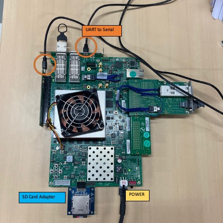

# Xlinx VCU 118 Evaluation Kit


# Hardware test environment: Ubuntu 18.04(VirtualBox) 
### Hardware test under the assumption that os works well on sd card.
    - FPGA(hardware): Flash memory – vivado
    - OS(Software): SD card - ubuntu

## Communication driver
### Between system board and assortment of logic devices.
###  Adept 2 :
https://reference.digilentinc.com/reference/software/adept/start

```Runtime-Latest Downloads -> supported OS -> All OS v2.21.2 Download. ```
### **Install**
``` 
Sudo ./install.sh
```

## Screen for connet FPGA and Ubuntu
 ```
 sudo screen -fa /dev/ttyUSB1 115200
```
**Caution:** Your device name may not be ttyUSB1. If so, test all ttyUSB*

Connect your computer and FGPA,  you can programming in Flush memory using vivado.

Refer VCU118 Board User Guide.


### **Wait...until boot linux.**
- ID: root / password: sifive

## Hardware conntect image 


# Software test 

## Follow priv-code-lock-sw manual, you can get work/bbl.bin 
    
- Check for sd card device name.
``` 
sudo fdisk -l
```
- **To load the compiled image to the SD card:**
```
dd if=work/bbl.bin of=/dev/your-sd-card bs=1M
```
    
#### **caution:** You have to format FAT32. 
---- 
## Reference: 
- VCU118 Board user guide, SIFIVE Freedom U500 FPGA getting Stated Guide.  
Link: https://sifive.cdn.prismic.io/sifive%2Fc248fabc-5e44-4412-b1c3-6bb6aac73a2c_sifive-u500-vc707-gettingstarted-v0.2.pdf
- Xilinx Virtex UltraScale+ FPGA VCU118 Evaluation Kit(Documentation)   
Link: https://www.xilinx.com/products/boards-and-kits/vcu118.html
- UG1244-VCU118 Evaluation Board User Guide (v.14)  
Link: https://www.xilinx.com/support/documentation/boards_and_kits/vcu118/ug1224-vcu118-eval-bd.pdf
